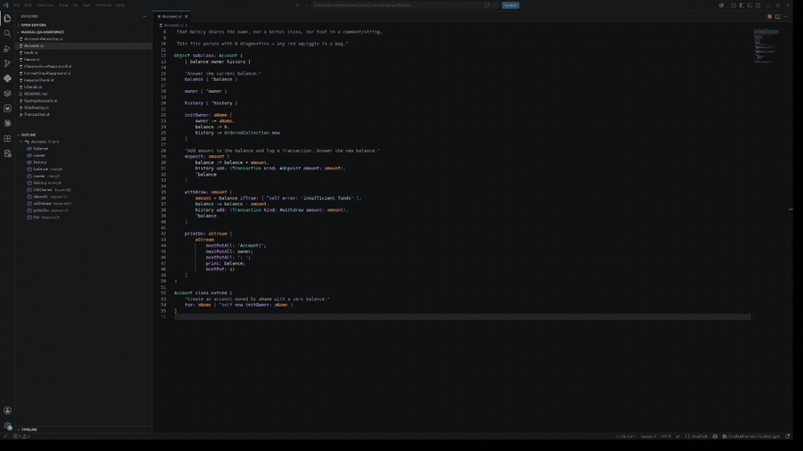
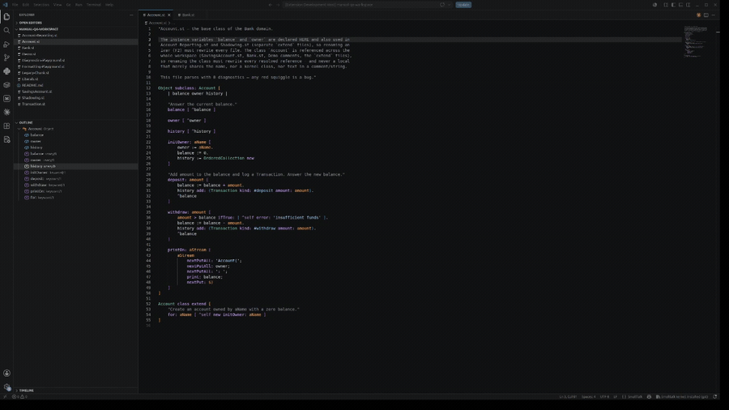
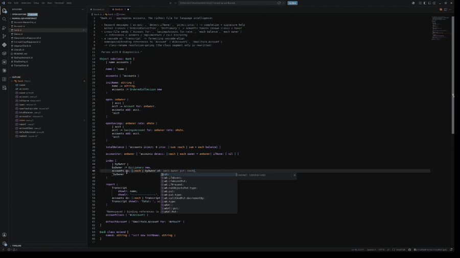
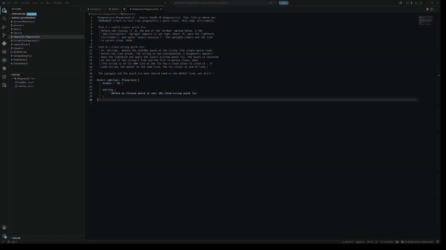
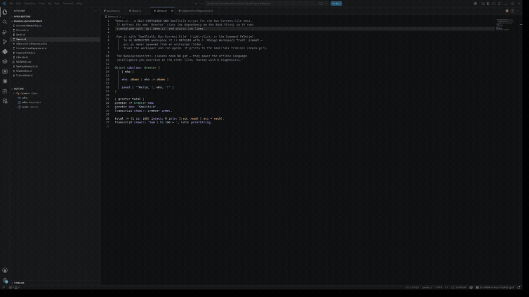

# Smalltalk for Visual Studio Code

**A complete, offline IDE experience for [GNU Smalltalk](https://www.gnu.org/software/smalltalk/) — IntelliSense, refactoring, diagnostics, and navigation, with no image and no `gst` required.**

[](https://github.com/leocamello/vscode-smalltalk/actions?query=workflow:main)
[](https://marketplace.visualstudio.com/items?itemName=leocamello.vscode-smalltalk)
[](https://marketplace.visualstudio.com/items?itemName=leocamello.vscode-smalltalk)
[](https://open-vsx.org/extension/leocamello/vscode-smalltalk)
[](LICENSE)

Rich language support for Smalltalk (`.st` / `.gst`) with a file-based workflow. All language
intelligence runs locally against a bundled TypeScript language server — **fully offline, zero network
I/O, and no telemetry** — so it works the moment you install it, with or without GNU Smalltalk on your
machine. Also on **[Open VSX](https://open-vsx.org/extension/leocamello/vscode-smalltalk)** for VSCodium,
Gitpod, and Eclipse Theia.

## Features

Everything here works **offline with no `gst` installed** — only *Run Current File* uses `gst`.

| | |
| :-- | :-- |
| **Syntax & semantic highlighting**<br>Role-accurate colors — instance vs. class variables, temporaries, parameters, selectors, and *real* classes.<br> | **Outline & navigation**<br>Outline, breadcrumbs, folding, workspace symbol search, and go-to-definition.<br> |
| **IntelliSense**<br>Completion over the GNU Smalltalk kernel + your workspace; keyword sends insert as snippets.<br> | **Diagnostics**<br>Syntax errors flagged as you type, with quick fixes to insert a missing closer or close a string.<br> |
| **Run Current File**<br>Execute the active `.st` / `.gst` with GNU Smalltalk in the integrated terminal.<br> | |

### Language intelligence — *no `gst` required*

- **IntelliSense / completion** — kernel classes & selectors + workspace symbols; multi-part keyword selectors insert as snippets (`at:put:`). Kernel source is your installed GNU Smalltalk when found, otherwise a bundled reference (GNU Smalltalk 3.2.5).
- **Hover** — selector signatures & implementors, class superclass chains, variable kinds, and numeric-literal decoding (`16rFF` → `255`).
- **Diagnostics** — live syntax squiggles badged `smalltalk(parse)`, with insert-closer / close-string quick fixes.
- **Semantic highlighting** — a capitalized name is colored as a *class* only when it resolves in your workspace or the kernel — otherwise a global.
- **References · Senders · Implementors · Call Hierarchy** — the System Browser's cross-reference muscle memory, framed as an **honest union** of your workspace and the kernel, each result tagged with its source (dynamic dispatch can't be resolved statically — likely responders rank first, none are hidden).
- **Signature help** — keyword messages show the matching selector(s) with the active parameter tracked.
- **Formatting** — conservative and **idempotent**: document / selection / on-type. It only rewrites whitespace, so comments and code are never changed; formatting twice changes nothing. A file with a syntax error is left untouched.
- **Rename (refactor)** — safe, scope-aware **Rename Symbol** (`F2`) for temporaries, arguments, instance variables, and **classes**, workspace-wide, with a Refactor Preview for multi-file changes. Selectors and kernel classes are refused with a reason rather than guessed.

### Editing

- **Syntax highlighting** for both brace- and chunk-format (`!`) files.
- **Snippets** — idiomatic block-bearing templates (`whileTrue:`, `on:do:`, `ifNil:ifNotNil:`, `inject:into:`, `detect:ifNone:`, …).
- **Bracket matching & autoclosing**, **comment toggling** (`Ctrl/Cmd+/`), **auto-indent**, and **folding**.

## Requirements

**GNU Smalltalk (`gst`) is optional.** Every editing and language-intelligence feature above works
**without it**. You only need `gst` for the **Run Current File** command, which executes your code.

- Install GNU Smalltalk from the [official site](https://www.gnu.org/software/smalltalk/) and ensure `gst` is on your `PATH` (or set [`smalltalk.gnuSmalltalkPath`](#settings)).
- Verify with `gst --version`.

## Quick start

1. **Install** — search `leocamello.vscode-smalltalk` in the Extensions view (`Ctrl/Cmd+Shift+X`), or get it from the [Marketplace](https://marketplace.visualstudio.com/items?itemName=leocamello.vscode-smalltalk) / [Open VSX](https://open-vsx.org/extension/leocamello/vscode-smalltalk).
2. **Open a `.st` file** — highlighting, completion, outline, and diagnostics activate immediately (no `gst` needed).
3. **Run it (optional)** — with `gst` installed, run **Smalltalk: Run Current File** from the Command Palette or the editor right-click menu:
   ```smalltalk
   Transcript showCr: 'Hello, Smalltalk!'.
   ```

## Settings

| Setting | Default | Description |
| --- | --- | --- |
| `smalltalk.gnuSmalltalkPath` | `""` | Absolute path to the `gst` executable. If empty, `gst` is looked up on your `PATH`. |
| `smalltalk.completion.kernelLibrary` | `auto` | Kernel-completion source: `auto` (installed kernel, else bundled), `bundled` (GNU Smalltalk 3.2.5 reference), or `off` (workspace symbols only). Active source is shown in the status bar. |
| `smalltalk.completion.kernelPath` | `""` | Optional path to a GNU Smalltalk kernel source directory (used when `kernelLibrary` is `auto`). Auto-discovered if empty. |
| `smalltalk.format.indentSize` | `4` | Spaces per indent level when formatting (tabs vs. spaces follow `editor.insertSpaces`). |
| `smalltalk.format.cascades` | `align` | Cascade layout — `align` (one segment per line) or `preserve`. |
| `smalltalk.format.keywordWrap` | `100` | Wrap a keyword message one-keyword-per-line past this column (`0` disables). |
| `smalltalk.format.blockStyle` | `preserve` | Block/method/class body layout — `preserve` your line breaks, or `expand` to one statement per line. |
| `smalltalk.trace.server` | `off` | Log the LSP client/server communication (`off` / `messages` / `verbose`). |

> Formatting is **always available** — it runs only on your format gestures (**Format Document** /
> **Format Selection**, or `editor.formatOnSave`) and is whitespace-only, so it never changes your code.

## Commands

Available from the Command Palette (`Ctrl/Cmd+Shift+P`) and the editor right-click menu on a Smalltalk file:

| Command | Description |
| --- | --- |
| **Smalltalk: Run Current File** | Save and run the active `.st` / `.gst` file with GNU Smalltalk in the integrated terminal. |
| **Smalltalk: Senders of…** | Find every send of the selector under the cursor (workspace ∪ kernel). |
| **Smalltalk: Implementors of…** | Find every implementor of the selector under the cursor (workspace ∪ kernel). |

## Privacy & Workspace Trust

- **No telemetry, fully offline.** The extension performs **no network I/O** and collects **no telemetry** — your code never leaves your machine. This is enforced by a guard test in CI.
- **Workspace Trust.** All language intelligence works in **Restricted Mode**. Because *Run Current File* executes code with `gst`, it is disabled until you trust the workspace, and a workspace-scoped `smalltalk.gnuSmalltalkPath` is ignored while untrusted.

## Troubleshooting

- **`gst` not found** — install GNU Smalltalk and ensure `gst` is on your `PATH`, or set `smalltalk.gnuSmalltalkPath` to its absolute path (e.g. `/usr/local/bin/gst`, or `C:\Program Files\GnuSmalltalk\gst.exe`). Only *Run Current File* needs it.
- **No highlighting** — confirm the file has a `.st` / `.gst` extension and the language mode (bottom-right) is **Smalltalk**; reload the window if needed.
- **Semantic colors missing** — set `editor.semanticHighlighting.enabled` to `true` (some themes default it off).

More help: the [GitHub issues page](https://github.com/leocamello/vscode-smalltalk/issues).

## Contributing

Contributions are welcome! This project follows a spec-driven process — see the
[Contribution Guide](CONTRIBUTING.md) and the [Roadmap](docs/ROADMAP.md). Bug reports and feature
requests are best filed with the [issue templates](https://github.com/leocamello/vscode-smalltalk/issues/new/choose).

## Feedback

File issues and ideas on the [GitHub issues page](https://github.com/leocamello/vscode-smalltalk/issues).
If the extension helps you, a Marketplace rating is much appreciated.

## License

[MIT](LICENSE).
